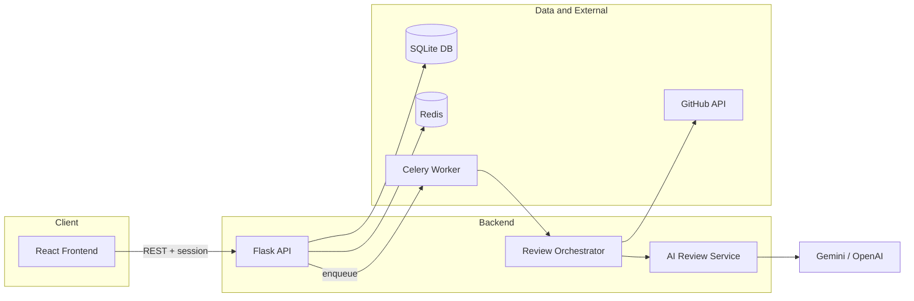

HYSY
# CodeBuster: Overview and Architecture

This document describes the product purpose, high-level architecture, main flows, and configuration of CodeBuster.

---

## 1. Product Purpose

CodeBuster is an **AI-powered GitHub code review platform**. It:

- Connects to GitHub via OAuth and (optionally) GitHub App to list repositories and access commits.
- Runs **scans** on a repository (or a specific commit) that execute a pipeline of static analyzers (security, lint, performance, IaC, accessibility, dimension analyzers, CodeQL, TruffleHog, Semgrep, etc.).
- Uses an **AI reasoning step** (Gemini or OpenAI) to produce an overall health score, category scores, prioritized issues, quick wins, and top risks from the raw findings.
- Persists **reviews** and **issues** in a SQLite database and exposes them via REST APIs.
- Provides a **React frontend** for dashboards, repository views, scan triggering, review detail (including canonical commit review JSON), findings with evidence and recommendations, and job/event monitoring.

The system is designed so that when Redis/Celery is unavailable, scans can run **inline** in a background thread and still produce full review results.

---

## 2. High-Level Architecture

- **Frontend**: React (Vite), React Router, Bootstrap. Uses an axios-based apiClient with session cookies; on 401/403 it dispatches an `auth-required` event and the shell redirects to login.
- **Backend**: Flask app in `backend/main.py`. Registers blueprints for auth, repos, review, issues, feedback, metrics, GitHub, and analyze. CORS is configured for the frontend origin(s). Health/ready endpoints at `/health` and `/ready`.
- **Database**: SQLite (`codebuster.db`) with models for User, Repository, Review, Issue, Feedback, and related scoring entities (ReviewRun, CategoryScore, ScoredIssue, FixFirstItem).
- **Redis**: Used for session storage (if configured), rate limiting, idempotency, token cache (GitHub installation tokens), and job/event lists for the metrics and jobs APIs. Optional for scan execution when `RUN_SCAN_INLINE=1` or when Redis is unreachable (inline scan fallback).
- **Celery**: Optional worker that consumes the `run_review` task. When Redis is available and `RUN_SCAN_INLINE` is not set, POST `/api/repos/:id/scan` enqueues a job and returns `job_id`; the frontend can poll GET `/api/jobs/:job_id` for status.
- **GitHub**: OAuth for user login and repo listing; GitHub App (optional) for installation tokens and webhook-driven events. Commits are fetched via GitHub API using either installation or user token.

---

## 3. Main Flows

### 3.1 Authentication

1. User opens the app (e.g. `/`). If not authenticated, they see the Home (login) page.
2. Login uses GitHub OAuth: frontend redirects to backend `/auth/github`, which redirects to GitHub; after authorization, GitHub redirects to `/auth/callback` with a code.
3. Backend exchanges the code for an access token, fetches user info, persists or updates the user in the DB, stores minimal user data in the session, and returns success (or redirects to frontend).
4. Frontend stores session cookie. Subsequent API calls send credentials; if any call returns 401 or 403, the apiClient dispatches `auth-required`; AppShell listens and calls logout, redirects to `/`, and shows a toast (e.g. "You're signed out or your session expired").
5. Logout: POST `/auth/logout` clears the session.

### 3.2 Scan Flow

1. User triggers a scan from the Repository Dashboard ("Run scan") or from the Commits tab ("Review" on a commit). Frontend calls POST `/api/repos/:repoId/scan` with optional body `{ "commit_sha": "..." }`.
2. Backend checks idempotency (if review already exists for that commit, returns 200 with `review_id` and `idempotent: true`). Otherwise it may:
   - Enqueue a Celery task and return 202 with `job_id`, or
   - Start an inline scan in a background thread and return 202 with `inline: true`, or
   - Return 503 if both Celery and inline fallback fail.
3. When a worker or the inline thread runs the scan, it loads repo and file context, calls the **Review Orchestrator**, which runs all enabled analyzers and then the **AI Review Service** (Gemini or OpenAI). The result is merged into the DB (Review + Issues) via the review merge service.
4. Frontend: if `job_id` is present, it shows ScanProgressBanner and polls GET `/api/jobs/:job_id` until status is completed or failed; if `inline`, it may poll GET latest-review until a new review appears. On completion, user can open the review (canonical or legacy).

### 3.3 Review Flow

1. Review data is stored after a scan completes: one Review row and multiple Issue rows, plus optional extra_metadata (analyzers_run, by_tool, duration_seconds).
2. Frontend can request:
   - GET `/api/repos/:repoId/latest-review` for the latest review summary, categories, top_issues, fix_first (used on repo dashboard).
   - GET `/api/reviews/:id` for a single review with issues (legacy shape).
   - GET `/api/reviews/:id/canonical` for the production-ready **codebuster.commit_review** JSON (repo, commit, status, scores, summary, analyzers, findings, etc.).
3. ReviewDetail page fetches canonical first, falls back to legacy; renders header (repo, commit, status), score overview, category chart, analyzers list, findings table, and next actions. Clicking a finding opens IssueDetailDrawer (evidence snippets, recommendation, severity, confidence).

---

## 4. Configuration Summary

| Purpose | Env variable | Where used |
|--------|--------------|------------|
| Flask secret | `FLASK_SECRET_KEY` | Session signing |
| GitHub OAuth | `GITHUB_CLIENT_ID`, `GITHUB_CLIENT_SECRET` | Auth routes |
| Frontend origin | `FRONTEND_URL` | CORS, OAuth redirects |
| AI review (preferred) | `GEMINI_API_KEY`, `GEMINI_MODEL` | ai_review_service |
| AI fallback | `OPENAI_API_KEY`, `OPENAI_MODEL` | ai_review_service |
| Job queue / cache | `REDIS_URL` | Celery, Redis client, metrics/jobs |
| Scan without Celery | `RUN_SCAN_INLINE=1` | repos scan route (use inline thread) |
| GitHub App | `GITHUB_APP_ID`, private key path, webhook secret | GitHub routes, installation tokens |

- **Backend config template**: [backend/config_template.env](config_template.env).
- **Setup and env details**: [backend/SETUP_ENV.md](../SETUP_ENV.md).

---

## 5. Related Documentation

- **Backend reference** (routes, services, models, tasks): [02_BACKEND_REFERENCE.md](02_BACKEND_REFERENCE.md).
- **Frontend reference** (pages, components, apiClient): [03_FRONTEND_REFERENCE.md](03_FRONTEND_REFERENCE.md).
- **APIs and flows** (endpoints, scan/review flows): [04_APIS_AND_FLOWS.md](04_APIS_AND_FLOWS.md).
- **JSON request/response shapes**: [JSON_FORMATS.md](JSON_FORMATS.md).
- **UI mapping (screens, components, states)**: [UI_DESIGN_JSON_TO_SCREENS.md](UI_DESIGN_JSON_TO_SCREENS.md).
