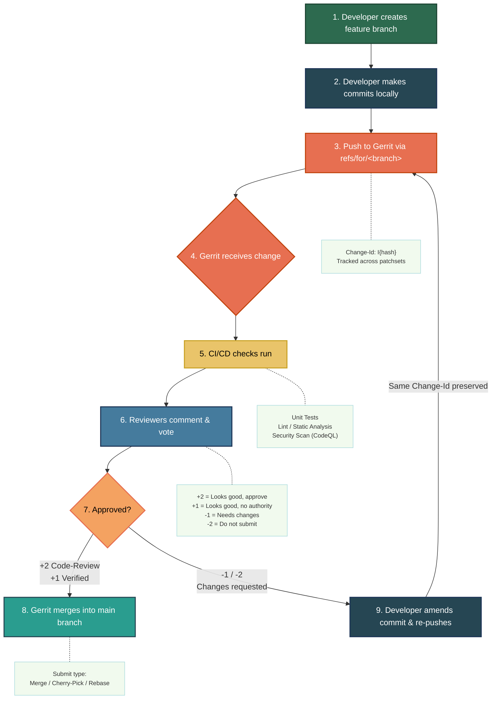

# Gerrit Code Review Workflow - Code Buster

## Workflow Summary

| Step | Action | Actor |
|------|--------|-------|
| 1 | Create feature branch from main | Developer |
| 2 | Make commits locally with `Change-Id` in commit message | Developer |
| 3 | Push via `git push origin HEAD:refs/for/main` | Developer |
| 4 | Change registered, patchset created | Gerrit |
| 5 | CI/CD pipeline triggered (unit tests, lint, security scan) | Automated |
| 6 | Reviewers examine diff, leave comments, cast votes | Reviewers |
| 7 | Decision: approved (+2) or changes requested (-1/-2) | Reviewers |
| 8 | Change merged into target branch | Gerrit |
| 9 | If rejected: amend commit, keep same Change-Id, re-push | Developer |

## Key Concepts

- **Change-Id**: A unique identifier (`Change-Id: I...`) in the commit message that links all patchsets of the same logical change.
- **Patchset**: Each re-push with the same Change-Id creates a new patchset on the same Gerrit change.
- **Voting Labels**: `Code-Review` (+2/+1/-1/-2) and `Verified` (+1/-1) from CI.
- **Submit Rules**: Requires at least one +2 on Code-Review and +1 on Verified (no -2 blocking).
